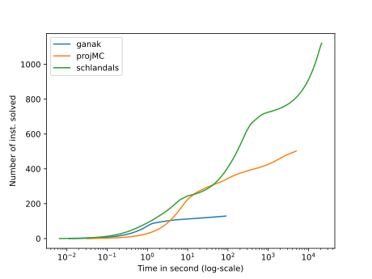
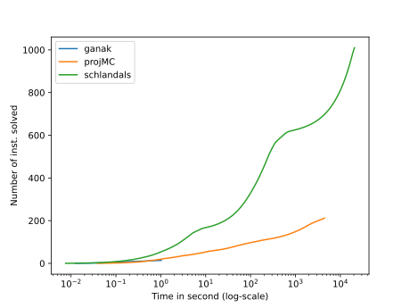
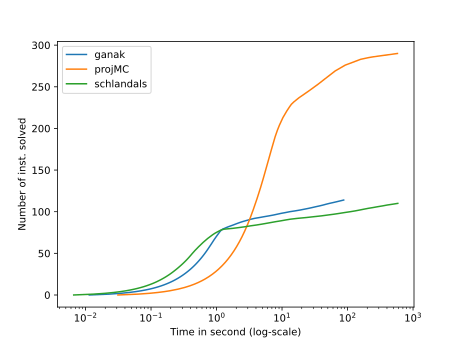

# Solvers configurations
### Ganak

- Commit hash: 18af6360fbb3e4899bc0a6135fd9167c08f10a19
- Command: `ganak -q`

### projMC

- Commit hash cf05bdfd068a2e08889478ac6c3cf2168e81e947
- Command: `d4 -m projMC -i`

### Schlandals

- Commit hash 29ae1f9a62797a4b126d98493a0d2d9ace49ac25
- Command: `schlandals -b neighbor-fiedler -i`

# Plots for the results of benchmark 2022_12_12_15_42_1670856154

For details about the instances, see file for a query by query comparison
## All instances

- ganak solved 130 in total
- projMC solved 504 in total
- schlandals solved 1122 in total

## bn

- details [here](./table_bn.md)
- ganak solved 15 instances in this problem
- projMC solved 213 instances in this problem
- schlandals solved 1011 instances in this problem

## pg

- details [here](./table_pg.md)
- ganak solved 115 instances in this problem
- projMC solved 291 instances in this problem
- schlandals solved 111 instances in this problem

