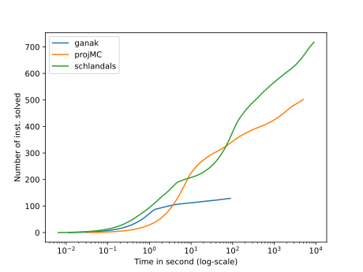
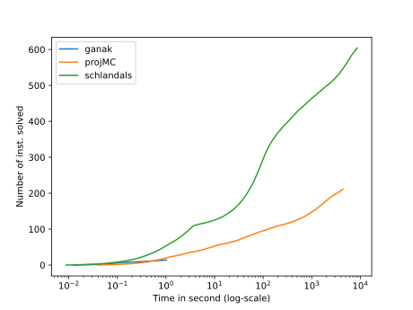
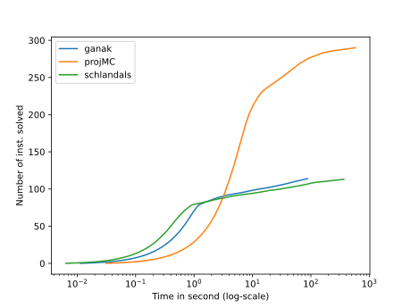

\# Solvers configurations
\#\#\# Ganak
\#\#\# projMC\#\#\# Schlandals
# Plots for the results of benchmark 2022_12_13_20_59_1670961560

For details about the instances, see file for a query by query comparison
## All instances

- ganak solved 130 in total
- projMC solved 503 in total
- schlandals solved 719 in total

## bn

- details [here](./table_bn.md)
- ganak solved 15 instances in this problem
- projMC solved 212 instances in this problem
- schlandals solved 605 instances in this problem

## pg

- details [here](./table_pg.md)
- ganak solved 115 instances in this problem
- projMC solved 291 instances in this problem
- schlandals solved 114 instances in this problem

