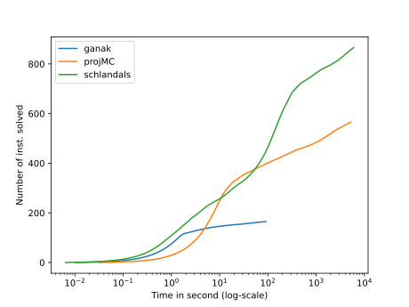
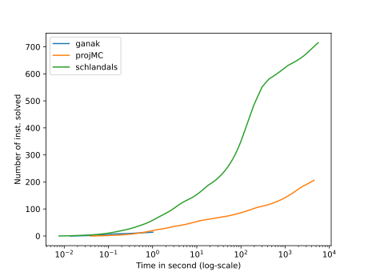
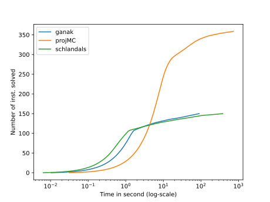

\# Solvers configurations
\#\#\# Ganak
\#\#\# projMC\#\#\# Schlandals
# Plots for the results of benchmark 2022_12_20_13_19_1671538756

For details about the instances, see file for a query by query comparison
## All instances

- ganak solved 166 in total
- projMC solved 567 in total
- schlandals solved 867 in total

## bn

- details [here](./table_bn.md)
- ganak solved 15 instances in this problem
- projMC solved 207 instances in this problem
- schlandals solved 716 instances in this problem

## pg

- details [here](./table_pg.md)
- ganak solved 151 instances in this problem
- projMC solved 360 instances in this problem
- schlandals solved 151 instances in this problem

