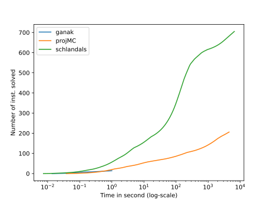
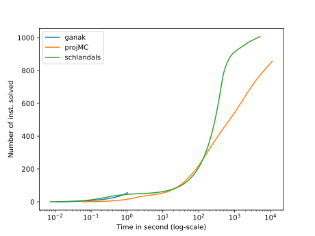

\# Solvers configurations
\#\#\# Ganak
- Commit hash: 18af6360fbb3e4899bc0a6135fd9167c08f10a19
- Command: ` ganak -q`\n
\#\#\# projMC
- Commit hash: cf05bdfd068a2e08889478ac6c3cf2168e81e947
- Command: ` d4 -m projMC -i`\n
\#\#\# Schlandals
- Commit hash: 2c04ee61733b28bed8672ce39cdb9f0a866c3dc5
- Command: ` schlandals -b children-fiedler-avg -i`\n
# Plots for the results of benchmark 2023_01_25_22_03_1674680584

For details about the instances, see file for a query by query comparison
## All instances

- ganak solved 71 in total
- projMC solved 1064 in total
- schlandals solved 1714 in total

## bn

- details [here](./table_bn.md)
- ganak solved 15 instances in this problem
- projMC solved 207 instances in this problem
- schlandals solved 706 instances in this problem

## wn

- details [here](./table_wn.md)
- ganak solved 56 instances in this problem
- projMC solved 857 instances in this problem
- schlandals solved 1008 instances in this problem

