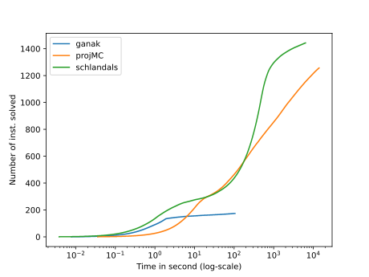
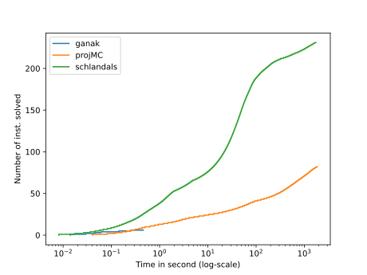
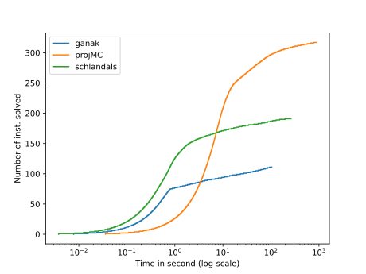
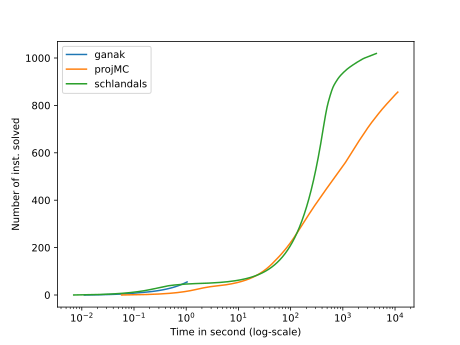

\# Solvers configurations

\#\#\# Ganak
- Commit hash: 18af6360fbb3e4899bc0a6135fd9167c08f10a19
- Command: ` ganak -q`

\#\#\# projMC
- Commit hash: cf05bdfd068a2e08889478ac6c3cf2168e81e947
- Command: ` d4 -m projMC -i`

\#\#\# Schlandals
- Commit hash: 240a6cfb3a14ca27b642befa17f7b960e4ab7b52
- Command: ` schlandals -b children-fiedler-avg -i`

# Plots for the results of benchmark 2023_01_30_09_16_1675066585

For details about the instances, see file for a query by query comparison
## All instances

- ganak solved 175 in total
- projMC solved 1258 in total
- schlandals solved 1444 in total

## bn

- details [here](./table_bn.md)
- ganak solved 7 instances in this problem
- projMC solved 83 instances in this problem
- schlandals solved 232 instances in this problem

## pg

- details [here](./table_pg.md)
- ganak solved 112 instances in this problem
- projMC solved 318 instances in this problem
- schlandals solved 192 instances in this problem

## wn

- details [here](./table_wn.md)
- ganak solved 56 instances in this problem
- projMC solved 857 instances in this problem
- schlandals solved 1020 instances in this problem

