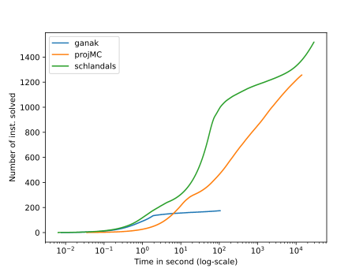
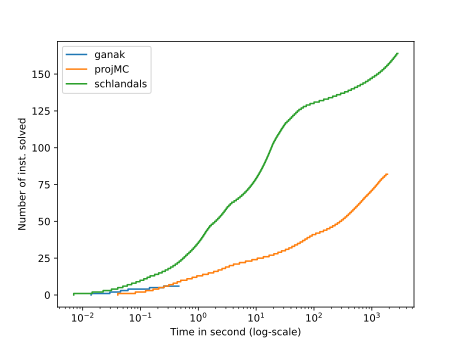
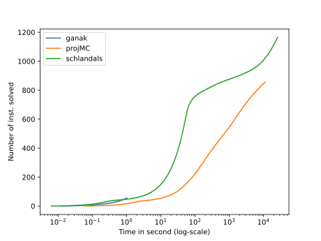

\# Solvers configurations

\#\#\# Ganak
- Commit hash: 18af6360fbb3e4899bc0a6135fd9167c08f10a19
- Command: ` symganak -q`

\#\#\# projMC
- Commit hash: cf05bdfd068a2e08889478ac6c3cf2168e81e947
- Command: ` d4 -m projMC -i`

\#\#\# Schlandals
- Commit hash: bb3f6edeec24e619b1037c115f27859496ee099e
- Command: ` schlandals -b fiedler -m 15000 -i`

# Plots for the results of benchmark 2023_03_29_18_27_1680107222

For details about the instances, see file for a query by query comparison
## All instances

- ganak solved 175 in total
- projMC solved 1258 in total
- schlandals solved 1520 in total

## bn

- details [here](./table_bn.md)
- ganak solved 7 instances in this problem
- projMC solved 83 instances in this problem
- schlandals solved 165 instances in this problem

## pg

- details [here](./table_pg.md)
- ganak solved 112 instances in this problem
- projMC solved 318 instances in this problem
- schlandals solved 189 instances in this problem

## wn

- details [here](./table_wn.md)
- ganak solved 56 instances in this problem
- projMC solved 857 instances in this problem
- schlandals solved 1166 instances in this problem

