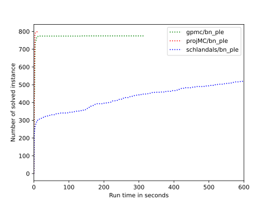
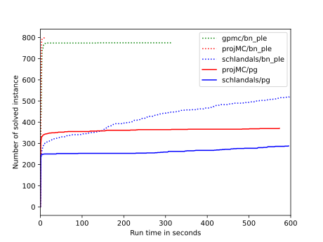
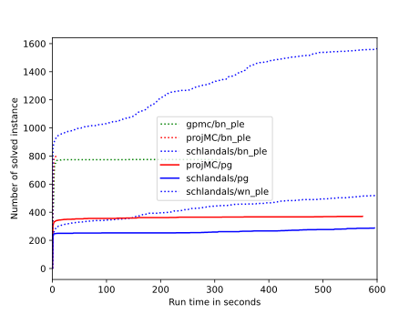

\# Solvers configurations

\#\#\# projMC
- Commit hash: cf05bdfd068a2e08889478ac6c3cf2168e81e947
- Command: `d4 -m projMC -f 1 -i `

\#\#\# GPMC
- Commit hash: 5c11662c1d8b6a5941014eaba281be91dc2122fd
- Command: `gpmc -mode=3 -cs=15000 `

\#\#\# Schlandals
- Commit hash: 33c95d5a1b3d41ad3f04b1e0950ad93ce7aa209e
- Command: `schlandals -b fiedler -m 15000 -i `

# Cactus plots for the problems
## Bayesian Networks

## Power Grid Networks

## Water Networks

